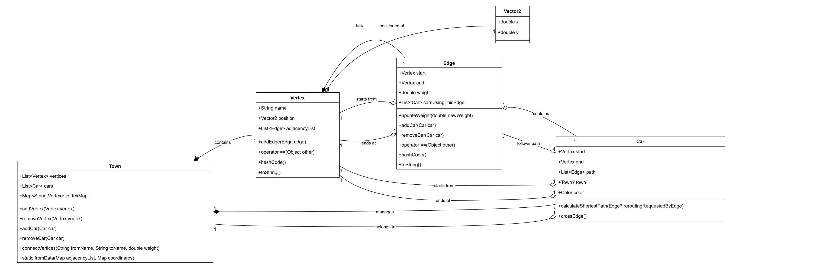
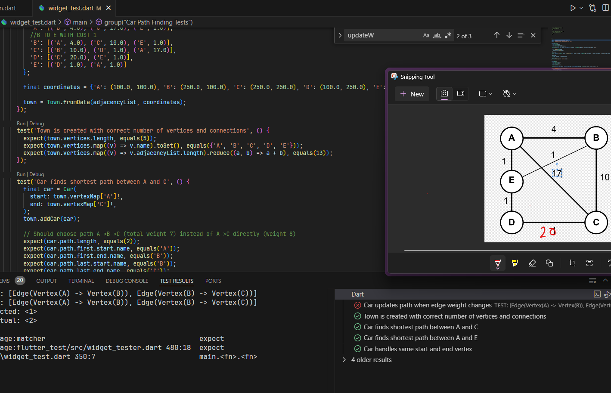

# Car Routing System Documentation

## Overview
This project implements a dynamic car routing system using Dijkstra's algorithm for pathfinding. The system allows for real-time route recalculation when road conditions change, manages multiple cars simultaneously, and provides a flexible town/road network structure.

## Key Features
- Dynamic pathfinding using Dijkstra's algorithm
- Real-time route recalculation when road conditions change
- Support for multiple cars with concurrent path management
- Flexible town structure with vertices (locations) and edges (roads)
- Integration with Flutter/Flame for visualization
- Efficient car traffic management on roads

## Core Classes

### Town
The `Town` class serves as the main container for the routing system.

#### Properties:
- `vertices`: List of all locations in the town
- `cars`: List of all cars in the system
- `vertexMap`: Quick lookup map for vertices by name

#### Key Methods:
- `addVertex(Vertex vertex)`: Adds a new location to the town
- `removeVertex(Vertex vertex)`: Removes a location from the town
- `addCar(Car car)`: Adds a new car and calculates its initial route
- `removeCar(Car car)`: Removes a car from the system
- `connectVertices(String fromName, String toName, double weight)`: Creates a road between two locations
- `fromData(Map<String, List<(String, double)>> adjacencyList, Map<String, (double, double)> coordinates)`: Factory method to create a town from data

- ## Class Diagram



### Car
The `Car` class represents a vehicle in the system with routing capabilities.

#### Properties:
- `start`: Starting vertex
- `end`: Destination vertex
- `path`: Current calculated route
- `town`: Reference to the town
- `color`: Visual representation color

#### Key Methods:
- `calculateShortestPath(Edge? reroutingRequestedByEdge)`: Implements Dijkstra's algorithm for pathfinding
- `crossEdge()`: Handles car movement between edges

#### Notable Features:
- Automatic route recalculation when road conditions change
- Smart handling of cars already on roads during rerouting
- Integration with the edge management system

### Edge
The `Edge` class represents roads between locations.

#### Properties:
- `start`: Starting vertex
- `end`: Ending vertex
- `weight`: Road traversal cost/time
- `carsUsingThisEdge`: List of cars currently using or planning to use this road

#### Key Methods:
- `updateWeight(double newWeight)`: Updates road conditions and triggers rerouting
- `addCar(Car car)`: Adds a car to the road
- `removeCar(Car car)`: Removes a car from the road

### Vertex
The `Vertex` class represents locations in the town.

#### Properties:
- `name`: Location identifier
- `position`: 2D coordinates for visualization
- `adjacencyList`: Connected roads

#### Key Methods:
- `addEdge(Edge edge)`: Connects a new road to this location

## Implementation Details

### Pathfinding Algorithm
The system uses Dijkstra's algorithm with the following optimizations:
- Priority queue for efficient vertex selection
- Early termination when destination is reached
- Support for dynamic weight updates

### Traffic Management
- Cars are tracked on each edge they plan to use
- Edge weights can be updated dynamically
- Routes are recalculated automatically when needed
- Smart handling of cars already on roads during rerouting

### Visualization Integration
- Integration with Flutter's widget system
- Flame game engine compatibility
- Support for custom car colors
- 2D position tracking for vertices

## Usage Example

```dart
void main() {
  group('Car Path Finding Tests', () {
    late Town town;

    setUp(() {
      // Create test town with consistent data
      final adjacencyList = {
        'A': [('B', 4.0), ('C', 8.0), ('E', 2.0)],
        'B': [('A', 4.0), ('C', 3.0)],
        'C': [('B', 3.0), ('D', 5.0), ('A', 6.0)],
        'D': [('C', 5.0), ('E', 2.0)],
        'E': [('D', 2.0), ('A', 2.0)]
      };

      final coordinates = {'A': (100.0, 100.0), 'B': (250.0, 100.0), 'C': (250.0, 250.0), 'D': (100.0, 250.0), 'E': (100.0, 175.0)};

      town = Town.fromData(adjacencyList, coordinates);
    });

    test('Town is created with correct number of vertices and connections', () {
      expect(town.vertices.length, equals(5));
      expect(town.vertexMap['A']?.adjacencyList.length, equals(3));
      expect(town.vertexMap['B']?.adjacencyList.length, equals(2));
      expect(town.vertexMap['C']?.adjacencyList.length, equals(3));
      expect(town.vertexMap['D']?.adjacencyList.length, equals(2));
      expect(town.vertexMap['E']?.adjacencyList.length, equals(2));
    });

    test('Car finds shortest path between A and C', () {
      final car = Car(
        start: town.vertexMap['A']!,
        end: town.vertexMap['C']!,
      );
      town.addCar(car);

      // Should choose path A->B->C (total weight 7) instead of A->C directly (weight 8)
      expect(car.path.length, equals(2));
      expect(car.path.first.start.name, equals('A'));
      expect(car.path.first.end.name, equals('B'));
      expect(car.path.last.start.name, equals('B'));
      expect(car.path.last.end.name, equals('C'));

      print('Expecting car on the road A->B');
      expect(town.vertexMap['A']!.adjacencyList.first.carsUsingThisEdge, contains(car));
    });

```

## Performance Considerations
- Efficient vertex lookup using `vertexMap`
- Priority queue implementation for pathfinding
- Smart rerouting that only recalculates when necessary
- Minimal object creation during path updates

## Error Handling
- Null safety throughout the codebase
- Proper equality implementations for vertices and edges
- Safe handling of edge cases in pathfinding
- Validation of car and road states

## Class Diagram


